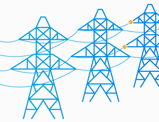

 <b style="font-size:25vw; font-weight:bold;">
 Exploring the impact of the energy transition on electricity distribution systems: 
 </b> 
 <b style="font-size:15vw;"> <i>The premises of a journey in search of equilibrium in the game between the network operator and its users </i>
 </b>
 

 

<b>Description</b> 
Repository containing the code that is used in the context of my Master thesis "Exploring the impact of the energy transition on electricity distribution systems: the premises of a journey in search of equilibrium in the game between the network operator and its users"

<b>Author</b>  
<i>Manon Cornet</i>
